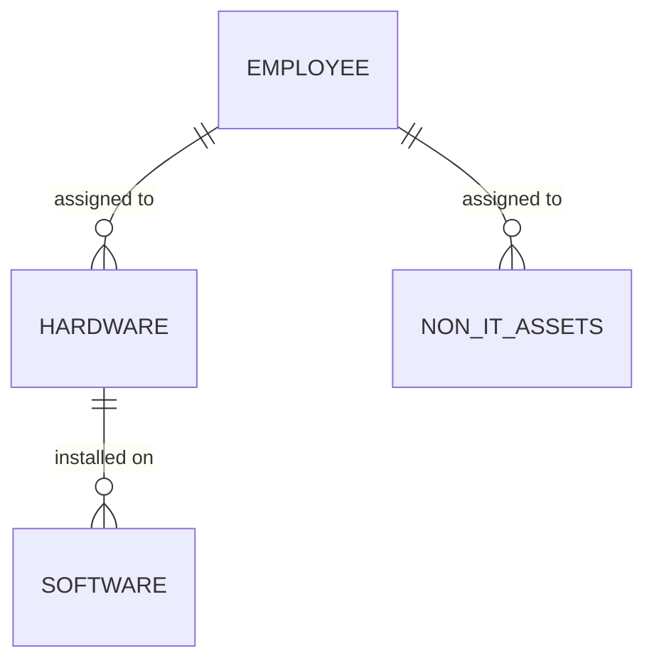

# MongoDB Database Design

This document outlines the schema design for the Asset Management project, optimized for MongoDB.

## Collections

### 1. `employees` (Team)
Stores details about team members who can be assigned assets.

| Field | Type | Description |
| :--- | :--- | :--- |
| `_id` | `ObjectId` | Primary key |
| `name` | `String` | Full name of the employee |
| `username`| `String` | Unique username |
| `email` | `String` | Unique email address |
| `workload`| `String` | `High`, `Medium`, or `Low` |
| `status` | `String` | `Active`, `Inactive`, etc. |
| `createdAt`| `Date` | Auto-generated timestamp |

### 2. `hardware`
Stores details about physical IT assets.

| Field | Type | Description |
| :--- | :--- | :--- |
| `_id` | `ObjectId` | Primary key |
| `assetId` | `String` | Formatted ID (e.g., `AST-101`) |
| `name` | `String` | Display name (e.g., MacBook Pro 16) |
| `manufacturer`| `String` | Manufacturer (e.g., Apple, Dell) |
| `modelName`| `String` | Model name (e.g., MacBook Pro) |
| `modelNumber`| `String` | Model number (e.g., A2780) |
| `serialNumber`| `String` | Unique serial number |
| `macAddress`| `String` | MAC address |
| `ipAddress` | `String` | IP address |
| `status` | `String` | `Active`, `Available`, `In Use`, `In Repair`, `Retired` |
| `assignee` | `String` | Name of assignee (or `ObjectId` reference to `employees`) |
| `purchaseDate`| `Date` | Date of purchase |

### 3. `software`
Stores details about software licenses and installations.

| Field | Type | Description |
| :--- | :--- | :--- |
| `_id` | `ObjectId` | Primary key |
| `name` | `String` | Display name |
| `version` | `String` | Version number |
| `publisher`| `String` | Software publisher |
| `packageName`| `String` | Internal package identifier (e.g., `adobe-cc`) |
| `installDate`| `Date` | Date of installation |
| `status` | `String` | `Active`, `Retired`, etc. |
| `installedMachine`| `String`| Name of machine or `ObjectId` reference to `hardware` |

### 4. `non_it_assets`
Stores details about furniture and office supplies.

| Field | Type | Description |
| :--- | :--- | :--- |
| `_id` | `ObjectId` | Primary key |
| `assetId` | `String` | Formatted ID (e.g., `AST-201`) |
| `name` | `String` | Item name |
| `status` | `String` | `Active`, `Retired`, etc. |
| `assignee` | `String` | Name of assignee, location, or `ObjectId` reference |
| `purchaseDate`| `Date` | Date of purchase |

## Relationships

## Implementation Notes
- **IDs**: Use MongoDB's default `_id` for internal references. The frontend displays `AST-{id}` or `EMP-{id}` which maps to these.
- **Validation**: Implement schema validation using Mongoose on the backend.
- **Indexes**: Create unique indexes on `employees.username`, `employees.email`, and `hardware.serialNumber`.
- **Status Mapping**:
    - **Hardware**: `Active`, `Available`, `In Use`, `In Repair`, `Retired`.
    - **Team Workload**: `High`, `Medium`, `Low`.